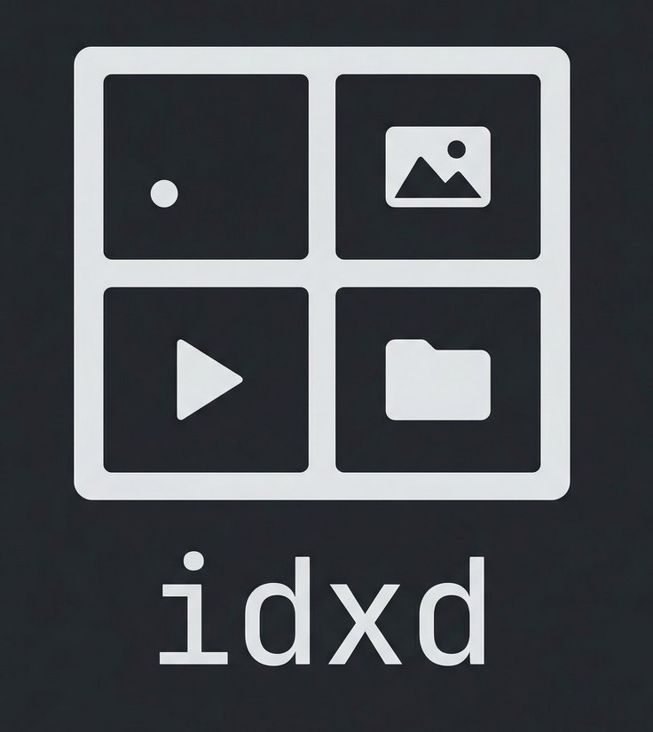
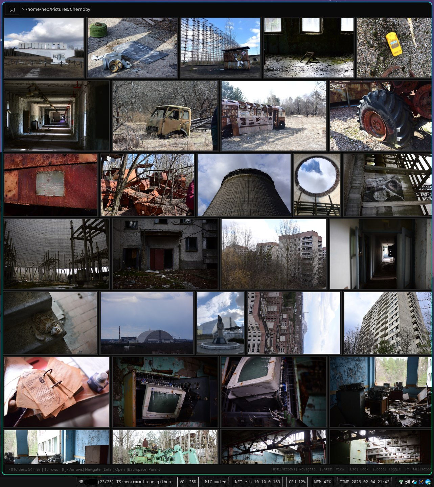

# idxd

`idxd` is a local desktop media browser for Linux.



## What It Does

- Displays folders and media files in a justified grid layout.
- Supports common image formats (`jpg`, `png`, `webp`, `gif`, `bmp`, `tiff`).
- Supports common video formats (`webm`, `mp4`, `mkv`, `avi`, `mov`).
- Opens a focused viewer mode for selected items.
- Provides keyboard-first navigation (`hjkl`/arrows, `Enter`, `Esc`, `Backspace`).



## Stack

- Language: Rust
- UI: GTK4
- Media/image handling: `image`, `libmpv2`
- Runtime/utilities: `tokio`, `tracing`
- Data/cache foundation: `rusqlite`

## Build and Run

```bash
cargo run --release -- /path/to/media
```

## Project Status

Vibe coded junk to solve a local pain (sorting through lots of fuji photos/vids into tags/status).

## License

MIT with Do No Evil provision.
Some code was generated with AI assistance; no warranty; if you believe it infringes, create issue; I’ll replace/remove.

Ciao
